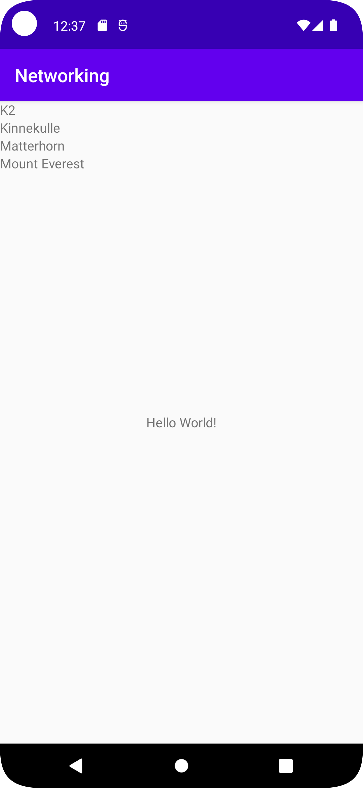

# Rapport

**Skriv din rapport här!**



Målet med denna uppgift har varit att hämta JSON-data från nätet och sedan presentera det i en recyclerview.

Denna applikation består av presenterar data, i detta fall JSON-data, som har hämtats från internet.
Det första som skapades har varit en RecyclerView, sedan en XML-fil där textviewen som visar bergnamnen finns tillhands. 
Det andra som skapades var en RecyclerViewAdapter skapades för att hantera data och en ViewHolder-klass skapades inuti den.
En recyclerAdapter tar hjälp av en Adapter som agerar som en handler och som då hanterar datan som ska visas upp.
För att skapa objekt från JSON-data skapades en Mountain-klass med variabler, 
constructor och getter, sedan skapades en XML-fil för att  visa informationen i TextView.

```
   public ViewHolder onCreateViewHolder(@NonNull ViewGroup parent, int viewType) {
        View view = LayoutInflater.from(parent.getContext()).inflate(R.layout.recyclerview_item, parent, false);
        return new ViewHolder(view);
    }
```
```
public void onPostExecute(String json) {
Log.d("MainActivity==>", json);
  Gson gson = new Gson();
  Type type = new TypeToken<List<Mountain>>() { }.getType();
ArrayList<Mountain> data = gson.fromJson(json, type);
  listOfMountains.addAll(data);
Log.d("Youssuf", String.valueOf(listOfMountains.size()));
  for (Mountain mountain : listOfMountains) {
item.add(new RecyclerViewItem(mountain.getName()));

        }
        adapter.newMountains(listOfMountains);
        adapter.notifyDataSetChanged();

    }
```
Metoden onPostExecute parsar JSON-datan in till en Arraylist som kallas för Mountain med hjälp av Gson.
RecyclerView uppdateras med den nya datan.

Denna kodsnutt representerar en override-metod för att skapa en ViewHolder som kommer att hålla en egen vy i en RecyclerView. 
Den skapar en vy med hjälp av en XML-fil och returnerar en ny ViewHolder.
## Följande grundsyn gäller dugga-svar:

- Ett kortfattat svar är att föredra. Svar som är längre än en sida text (skärmdumpar och programkod exkluderat) är onödigt långt.
- Svaret skall ha minst en snutt programkod.
- Svaret skall inkludera en kort övergripande förklarande text som redogör för vad respektive snutt programkod gör eller som svarar på annan teorifråga.
- Svaret skall ha minst en skärmdump. Skärmdumpar skall illustrera exekvering av relevant programkod. Eventuell text i skärmdumpar måste vara läsbar.
- I de fall detta efterfrågas, dela upp delar av ditt svar i för- och nackdelar. Dina för- respektive nackdelar skall vara i form av punktlistor med kortare stycken (3-4 meningar).

Programkod ska se ut som exemplet nedan. Koden måste vara korrekt indenterad då den blir lättare att läsa vilket gör det lättare att hitta syntaktiska fel.

```
function errorCallback(error) {
    switch(error.code) {
        case error.PERMISSION_DENIED:
            // Geolocation API stöds inte, gör något
            break;
        case error.POSITION_UNAVAILABLE:
            // Misslyckat positionsanrop, gör något
            break;
        case error.UNKNOWN_ERROR:
            // Okänt fel, gör något
            break;
    }
}
```

Bilder läggs i samma mapp som markdown-filen.


Läs gärna:

- Boulos, M.N.K., Warren, J., Gong, J. & Yue, P. (2010) Web GIS in practice VIII: HTML5 and the canvas element for interactive online mapping. International journal of health geographics 9, 14. Shin, Y. &
- Wunsche, B.C. (2013) A smartphone-based golf simulation exercise game for supporting arthritis patients. 2013 28th International Conference of Image and Vision Computing New Zealand (IVCNZ), IEEE, pp. 459–464.
- Wohlin, C., Runeson, P., Höst, M., Ohlsson, M.C., Regnell, B., Wesslén, A. (2012) Experimentation in Software Engineering, Berlin, Heidelberg: Springer Berlin Heidelberg.
